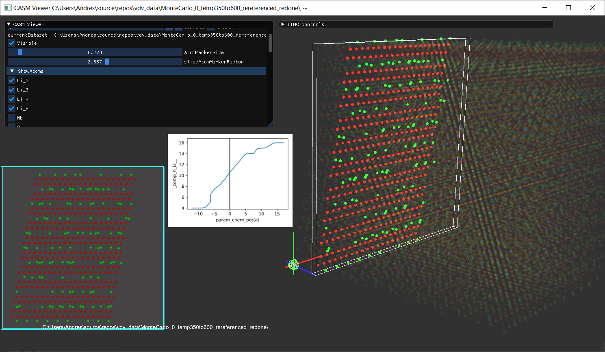
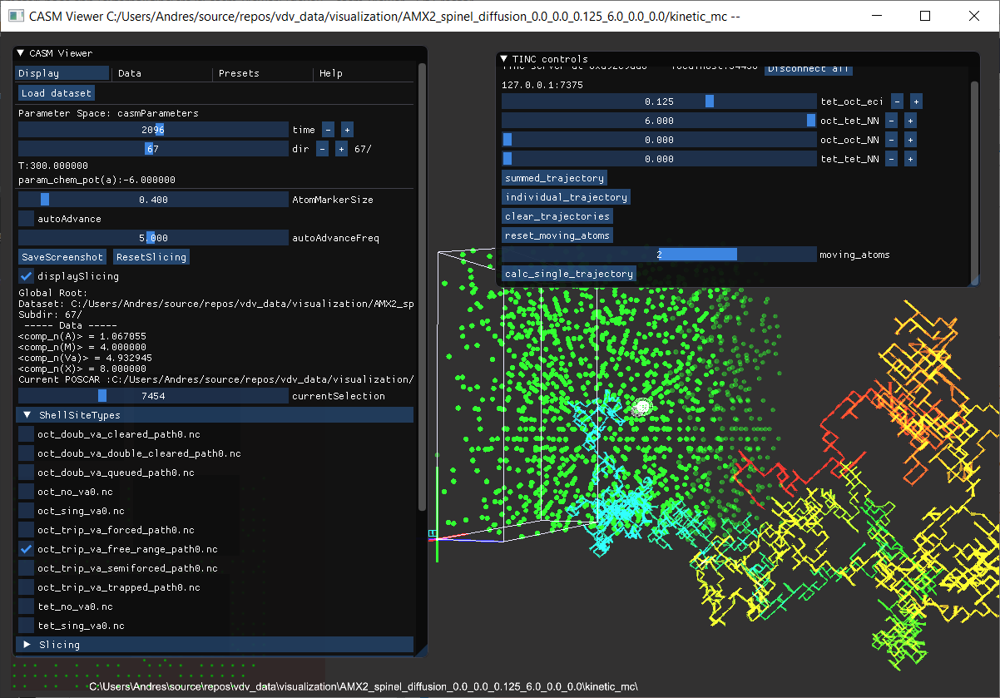

# CASM Viewer

Interactive visualization of CASM output.





# Keyboard Commands

    [,]    - Scale layer view
    -, =   - prev/next layer in perspective view
    O, P   - Temperature prev/next
    L, ;   - Chempot A prev/next
    . , /  - Chempot B prev/next
    Q, W   - Preset prev/next
    B, V   - Perspective rotate step up/down
    A, S   - Start/Stop sequence
    Shift-A, (Shift-)S - Start/stop record
    SPACE - Toggle GUI visibility

# Configuration
The *casm_viewer.toml* file is used to configure the application. There you can set system specific paths and dataset paths and settings.
    pythonScriptsPath - The path to the python scripts folder for this project
    pythonBinary - The python binary to be sued for scripts

View options:

    sliceBackground - Background color for slice (RGBA)
    fontSize = 32.000000000000000
    background - General bakcgroun color (RGBA)

# Building

Make sure you run:

    git submodule update --init --recursive
    
To get all the needed submodules.

You can then use the ```run.sh``` script inside a bash shell (on Windows, Linux or macOS) or open the CMakeLists.txt file in an IDE that supports cmake.
